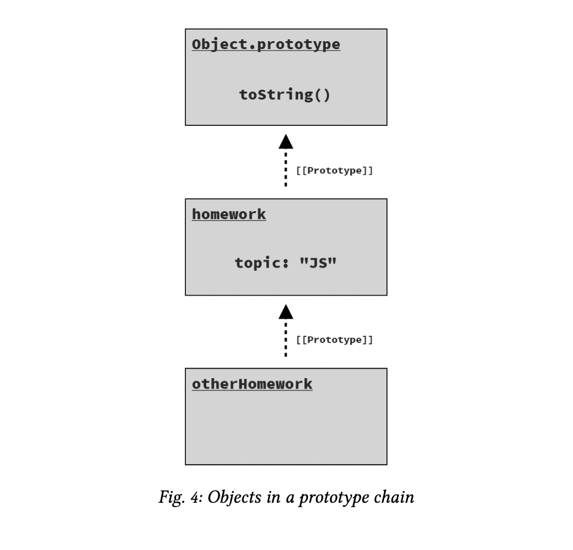
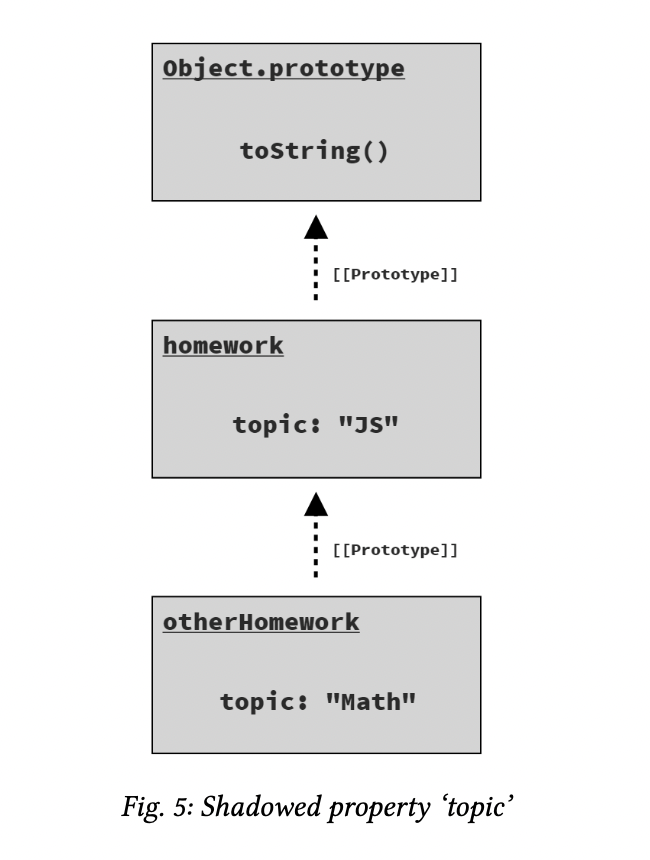
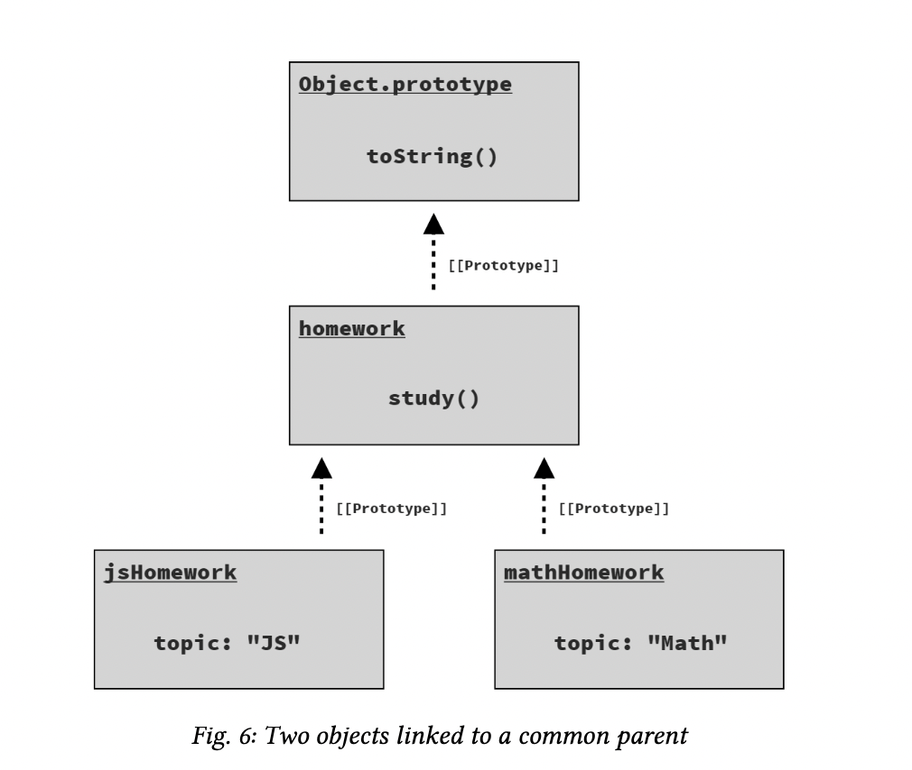

### Table of contents: <!-- omit in toc -->

- [Chapter 3: Digging to the Roots of JS](#chapter-3-digging-to-the-roots-of-js)
    - [Iteration](#iteration)
      - [Consuming Iterators](#consuming-iterators)
      - [Iterables](#iterables)
    - [Closure](#closure)
    - [*this* Keyword](#this-keyword)
    - [Prototypes](#prototypes)
      - [Object Linkage](#object-linkage)
      - [this Revisited](#this-revisited)
    - [Asking “Why?”](#asking-why)

# Chapter 3: Digging to the Roots of JS

This chapter digs much deeper than you’re likely used to thinking about a programming language. My goal is to help you appreciate the core of how JS works, what makes it tick. This chapter should begin to answer some of the “Why?” questions that may be cropping up as you explore JS.

### Iteration

Since programs are essentially built to process data (and make decisions on that data), the patterns used to step through the data have a big impact on the program’s readability.

The iterator pattern defines a data structure called an “iter- ator” that has a reference to an underlying data source (like the query result rows), which exposes a method like next(). Calling next() returns the next piece of data (i.e., a “record” or “row” from a database query).

The importance of the iterator pattern is in adhering to a standard way of processing data iteratively, which creates cleaner and easier to understand code, as opposed to having every data structure/source define its own custom way of handling its data.

#### Consuming Iterators

ES6 also included several mechanisms (syntax and APIs) for standardized consumption of these iterators.

One such mechanism is the for..of loop:

```Js
// given an iterator of some data source:
var it = /* .. */;
// loop over its results one at a time
for (let val of it) {
    console.log(`Iterator value: ${ val }`);
}
// Iterator value: ..
// Iterator value: ..
// ..
```

Another mechanism that’s often used for consuming iterators is the ... operator. 

This operator actually has two symmetri- cal forms: spread and rest (or gather, as I prefer). The spread form is an iterator-consumer.

To spread an iterator, you have to have something to spread it into. 

There are two possibilities in JS: an **array** or an **argument list** for a function call.

An array spread:

```js
// spread an iterator into an array, 
// with each iterated value occupying 
// an array element position.
var vals = [ ...it ];
```
A function call spread:

```js
// spread an iterator into a function,
// call with each iterated value
// occupying an argument position.
doSomethingUseful( ...it );
```

In both cases, the iterator-spread form of ... follows the iterator-consumption protocol (the same as the for..of loop) to retrieve all available values from an iterator and place (aka, spread) them into the receiving context (array, argument list).

#### Iterables

The iterator-consumption protocol is technically defined for consuming iterables; an iterable is a value that can be iterated over.

ES6 defined the basic data structure/collection types in JS as iterables. This includes strings, arrays, maps, sets, and others.

Consider:

```Js
// an array is an iterable
var arr = [ 10, 20, 30 ];
for (let val of arr) {
    console.log(`Array value: ${ val }`);
}
// Array value: 10
// Array value: 20
// Array value: 30
```

Since arrays are iterables, we can shallow-copy an array using iterator consumption via the ... spread operator:

```Js
var arrCopy = [ ...arr ];
```

We can also iterate the characters in a string one at a time:

```Js
var greeting = "Hello world!"; 
var chars = [ ...greeting ];

chars;
// [ "H", "e", "l", "l", "o", " ",
//   "w", "o", "r", "l", "d", "!" ]
```

A Map data structure uses objects as keys, associating a value (of any type) with that object.

Maps have a different default iteration than seen here, in that the iteration is not just over the map’s values but instead its entries.

An entry is a tuple (2-element array) including both a key and a value.

Consider:

```Js
// given two DOM elements, `btn1` and `btn2`
var buttonNames = new Map(); 
buttonNames.set(btn1,"Button 1"); 
buttonNames.set(btn2,"Button 2");

for (let [btn,btnName] of buttonNames) { 
    btn.addEventListener("click",function onClick(){
        console.log(`Clicked ${ btnName }`); 
    });
}
```

In the for..of loop over the default map iteration, we use the **[btn,btnName]** syntax (called *“array destructuring”*) to break down each consumed tuple into the respective key/- value pairs (btn1 / "Button 1" and btn2 / "Button 2").

Each of the built-in iterables in JS expose a default iteration, one which likely matches your intuition. But you can also choose a more specific iteration if necessary.

For example, if we want to consume only the values of the above but- tonNames map, we can call values() to get a values-only iterator:

```Js
for (let btnName of buttonNames.values()) { 
    console.log(btnName);
}
// Button 1
// Button 2
```

Or if we want the index and value in an array iteration, we can make an entries iterator with the entries() method:

```Js
var arr = [ 10, 20, 30 ];

for (let [idx,val] of arr.entries()) { 
    console.log(`[${ idx }]: ${ val }`);
}
// [0]: 10
// [1]: 20
// [2]: 30
```

For the most part, all built-in iterables in JS have three iterator forms available: keys-only (keys()), values-only (values()), and entries (entries()).

### Closure

Perhaps without realizing it, almost every JS developer has made use of closure.

It might even be as important to understand as variables or loops; that’s how fundamental it is.

We need to be able to recognize where closure is used in programs, as the presence or lack of closure is sometimes the cause of bugs (or even the cause of performance issues).

So let’s define closure in a pragmatic and concrete way:

*Closure is when a function remembers and contin- ues to access variables from outside its scope, even when the function is executed in a different scope.*

We see two definitional characteristics here.

First, closure is part of the nature of a function. Objects don’t get closures, functions do.

Second, to observe a closure, you must execute a function in a different scope than where that function was originally defined.

Consider:

```Js
function greeting(msg) { 
    return function who(name) {
        console.log(`${ msg }, ${ name }!`); 
    };
}

var hello = greeting("Hello");
var howdy = greeting("Howdy"); 

hello("Kyle");
// Hello, Kyle!

hello("Sarah");
// Hello, Sarah!

howdy("Grant");
// Howdy, Grant!
```

First, the greeting(..) outer function is executed, creating an instance of the inner function who(..); that function closes over the variable msg, which is the parameter from the outer scope of greeting(..).

When that inner function is returned, its reference is assigned to the hello variable in the outer scope.

Then we call greeting(..) a second time, creating a new inner function instance, with a new closure over a new msg, and return that reference to be assigned to howdy.

When the greeting(..) function finishes running, normally we would expect all of its variables to be garbage collected (removed from memory).

We’d expect each msg to go away, but they don’t. The reason is closure.

Since the inner function instances are still alive (assigned to hello and howdy, respec- tively), their closures are still preserving the msg variables.

These closures are not a snapshot of the msg variable’s value; they are a **direct link** and preservation of the variable itself.

That means closure can actually observe (or make!) updates to these variables over time.

```Js
function counter(step = 1) { 
    var count = 0;
    return function increaseCount(){ 
        count = count + step; 
        return count;
    }; 
}
var incBy1 = counter(1); 
var incBy3 = counter(3);

incBy1(); //1 
incBy1(); //2

incBy3(); //3 
incBy3(); //6 
incBy3(); //9
```

Each instance of the inner increaseCount() function is closed over both the count and step variables from its outer counter(..) function’s scope.

Since closure is over the variables and not just snapshots of the values, these updates are preserved.

Closure is most common when working with asynchronous code, such as with callbacks. Consider:

```Js
function getSomeData(url) { 
    ajax(url,function onResponse(resp){
        console.log(
            `Response (from ${ url }): ${ resp }`
        ); 
    });
}
getSomeData("https://some.url/wherever");
// Response (from https://some.url/wherever): ...
```

The inner function onResponse(..) is closed over url, and thus preserves and remembers it until the Ajax call re- turns and executes onResponse(..).

Even though getSome- Data(..) finishes right away, the url parameter variable is kept alive in the closure for as long as needed.


It’s not necessary that the outer scope be a function—it usually is, but not always—just that there be at least one variable in an outer scope accessed from an inner function:

```Js

for (let [idx,btn] of buttons.entries()) { 
    btn.addEventListener("click",function onClick(){ 
        console.log(`Clicked on button (${ idx })!`);
    }); 
}
```


Because this loop is using let declarations, each iteration gets new block-scoped (aka, local) idx and btn variables; the loop also creates a new inner onClick(..) function each time.

That inner function closes over idx, preserving it for as long as the click handler is set on the btn.

So when each button is clicked, its handler can print its associated index value,
because the handler remembers its respective idx variable.

Remember: this closure is not over the value (like 1 or 3), but
over the variable idx itself.

### *this* Keyword

One of JS’s most powerful mechanisms is also one of its most misunderstood: the this keyword.

Functions also have another characteristic besides their scope that influences what they can access. This characteristic is best described as an **execution context**, and it’s exposed to the function via its *this* keyword.

this is not a fixed characteristic of a function based on the function’s definition, but rather a dynamic characteristic that’s determined each time the function is called.

One way to think about the execution context is that it’s a tangible object whose properties are made available to a function while it executes.

Compare that to scope, which can also be thought of as an object; except, the scope object is hidden inside the JS engine, it’s always the same for that function, and its properties take the form of identifier variables available inside the function.

```Js
function classroom(teacher) { 
    return function study() {
        console.log(
            `${ teacher } says to study ${ this.topic }`
        );
    };
}
var assignment = classroom("Kyle");
```

The outer classroom(..) function makes no reference to a this keyword, so it’s just like any other function we’ve seen so far.

But the inner study() function does reference this, which makes it a this-aware function. In other words, it’s a function that is dependent on its *execution context*.

The inner study() function returned by classroom("Kyle") is assigned to a variable called assignment. So how can assignment() (aka study()) be called?

```Js
assignment();
// Kyle says to study undefined  -- Oops :(
```

In this snippet, we call assignment() as a plain, normal function, without providing it any execution context.

Now consider:

```Js
var homework = { 
    topic: "JS",
    assignment: assignment
};
homework.assignment();
// Kyle says to study JS
```

the this for that function call will be the homework object. Hence, this.topic resolves to "JS".

Lastly:

```Js
var otherHomework = { 
    topic: "Math"
};
assignment.call(otherHomework);
// Kyle says to study Math
```

A third way to invoke a function is with the call(..) method, which takes an object (otherHomework here) to use for setting the this reference for the function call. The property reference this.topic resolves to "Math".

A function that closes over a scope can never reference a different scope or set of variables. But a function that has dynamic this context awareness can be quite helpful for certain tasks.

### Prototypes

Where this is a characteristic of function execution, a proto- type is a characteristic of an object, and specifically resolution of a property access.

Think about a prototype as a linkage between two objects; the linkage is hidden behind the scenes, though there are ways to expose and observe it.

This prototype linkage occurs when an object is created; it’s linked to another object that already exists.

The purpose of this prototype linkage (i.e., from an object B to another object A) is so that accesses against B for properties/methods that B does not have, are delegated to A to handle.

Delegation of property/method access allows two (or more!) objects to cooperate with each other to perform a task.

#### Object Linkage

To define an object prototype linkage, you can create the object using the Object.create(..) utility:

```Js
var homework = { 
    topic: "JS"
};

var otherHomework = Object.create(homework); 

otherHomework.topic; // "JS"
```

The first argument to Object.create(..) specifies an ob- ject to link the newly created object to, and then returns the newly created (and linked!) object.

Figure 4 shows how the three objects (otherHomework, home- work, and Object.prototype) are linked in a prototype chain:



Consider: 

```Js
homework.topic;
// "JS"

otherHomework.topic;
// "JS"

otherHomework.topic = "Math";
otherHomework.topic;
// "Math"

homework.topic;
// "JS" -- not "Math"
```
The assignment to topic creates a property of that name directly on otherHomework; **there’s no effect on the topic property on homework.**

The next statement then accesses otherHomework.topic, and we see the non-delegated an- swer from that new property: "Math".

Figure 5 shows the objects/properties after the assignment
that creates the otherHomework.topic property:



The topic on otherHomework is “shadowing” the property of the same name on the homework object in the chain.

### Note <!-- omit in toc -->

Another frankly more convoluted but perhaps still more common way of creating an object with a prototype linkage is using the “prototypal class” pattern, from before class (see Chapter 2, “Classes”) was added in ES6. We’ll cover this topic in more detail in Appendix A, “Prototypal ‘Classes’”.

#### this Revisited

Its true importance shines when considering how it powers prototype-delegated function calls.

one of the main reasons *this* supports dynamic context based on how the function is called is so that method calls on objects which delegate through the prototype chain still maintain the expected this.

```Js
var homework = { 
    study() {
        console.log(`Please study ${ this.topic }`); 
    }
};
var jsHomework = Object.create(homework); 
jsHomework.topic = "JS"; 
jsHomework.study();
// Please study JS

var mathHomework = Object.create(homework); 
mathHomework.topic = "Math"; mathHomework.study();
// Please study Math
```

The two objects jsHomework and mathHomework each pro- totype link to the single homework object, which has the study() function.

jsHomework and mathHomework are each given their own topic property (see Figure 6).



jsHomework.study() delegates to homework.study(), but its this (this.topic) for that execution resolves to jsHome- work because of how the function is called, so this.topic is "JS". Similarly for mathHomework.study() delegating to homework.study() but still resolving this to mathHome- work, and thus this.topic as "Math".

### Asking “Why?”

One of the most important skills you can practice and bolster is curiosity, and the art of asking “Why?” when you encounter something in the language.
Even though this chapter has gone quite deep on some of the topics, many details have still been entirely skimmed over. There’s much more to learn here, and the path to that starts with you asking the right questions of your code. Asking the right questions is a critical skill of becoming a better developer.

