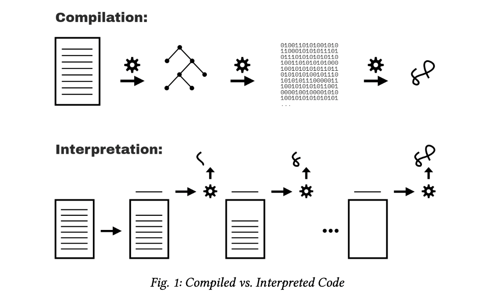

### Table of contents: <!-- omit in toc -->

- [Chapter 1: What’s the Scope?](#chapter-1-whats-the-scope)
    - [Compiled vs. Interpreted](#compiled-vs-interpreted)
    - [Compiling Code](#compiling-code)
    - [Required: Two Phases](#required-two-phases)
      - [Syntax Errors from the Start](#syntax-errors-from-the-start)
      - [Early Errors](#early-errors)
      - [Hoisting](#hoisting)
    - [Compiler Speak](#compiler-speak)
      - [Targets](#targets)
      - [Sources](#sources)
    - [Cheating: Runtime Scope Modifications](#cheating-runtime-scope-modifications)
      - [Lexical Scope](#lexical-scope)

# Chapter 1: What’s the Scope?

This book will dig through all aspects of scope—how it works, what it’s useful for, gotchas to avoid—and then point toward common scope patterns that guide the structure of programs.

Our first step is to uncover how the JS engine processes our program before it runs.

JS functions are themselves first-class values; they can be assigned and passed around just like numbers or strings. But since these functions hold and access variables, they maintain their original scope no matter where in the program the functions are eventually executed. This is called closure.
Modules are a code organization pattern characterized by public methods that have privileged access (via closure) to hidden variables and functions in the internal scope of the module.

### Compiled vs. Interpreted



It’s not mysterious or magical, though. Code compilation is a set of steps that process the text of your code and turn it into a list of instructions the computer can understand.

Modern JS engines actually employ numerous variations of both compilation and interpretation in the handling of JS programs.

### Compiling Code

But first, why does it even matter whether JS is compiled or not?

Scope is primarily determined during compilation, so un- derstanding how compilation and execution relate is key in mastering scope.

JS engines don’t have the luxury of an abundance of time to perform their work and optimizations, because JS compilation doesn’t happen in a build step ahead of time, as with other languages.

It usually must happen in mere microseconds (or less!) right before the code is executed.

To ensure the fastest performance under these constraints, JS engines use all kinds of tricks (like JITs, which lazy compile and even hot re- compile); these are well beyond the “scope” of our discussion here.

### Required: Two Phases

The separation of a parsing/compilation phase from the sub- sequent execution phase is observable fact, not theory or opin- ion. While the JS specification does not require “compilation” explicitly, it requires behavior that is essentially only practical with a compile-then-execute approach.

There are three program characteristics you can observe to prove this to yourself: syntax errors, early errors, and hoisting.

#### Syntax Errors from the Start

```Js
var greeting = "Hello"; console.log(greeting);

greeting = ."Hi";

// SyntaxError: unexpected token .
```
This program produces no output ("Hello" is not printed), but instead throws a SyntaxError about the unexpected .

if JS was executing top-down line by line, one would expect the "Hello" message being printed before the syntax error being thrown. That doesn’t happen.

In fact, the only way the JS engine could know about the syntax error on the third line, before executing the first and second lines, is by the JS engine first parsing the entire program before any of it is executed.

#### Early Errors

```Js
console.log("Howdy");

saySomething("Hello","Hi");
// Uncaught SyntaxError: Duplicate parameter name not
// allowed in this context

function saySomething(greeting,greeting) { "use strict";
    console.log(greeting);
}
```

The SyntaxError here is thrown before the program is exe- cuted. In this case, it’s because strict-mode (opted in for only the saySomething(..) function here) forbids, among many other things, functions to have duplicate parameter names; this has always been allowed in non-strict-mode.

The error thrown is not a syntax error in the sense of be- ing a malformed string of tokens (like ."Hi" prior), but in strict-mode is nonetheless required by the specification to be thrown as an “early error” before any execution begins.

the only reasonable explanation is that the code must
first be fully parsed before any execution occurs.

#### Hoisting

```Js
function saySomething() { 
    var greeting = "Hello"; 
    {
    greeting = "Howdy"; // error comes from here 
    let greeting = "Hi";
    console.log(greeting);
    } 
}
saySomething();
// ReferenceError: Cannot access 'greeting' before
// initialization
```

The noted ReferenceError occurs from the line with the statement greeting = "Howdy".

What’s happening is that the greeting variable for that statement belongs to the declaration on the next line, let greeting = "Hi", rather than to the previous var greeting = "Hello" statement.

### Warning <!-- omit in toc -->
*It’s often asserted that let and const declara- tions are not hoisted, as an explanation of the TDZ behavior just illustrated. But this is not accurate. We’ll come back and explain both the hoisting and TDZ of let/const in Chapter 5.*

In spirit and in practice, what the engine is doing in processing JS programs is much more alike compilation than not.

Classifying JS as a compiled language is not concerned with the distribution model for its binary (or byte-code) executable representations, but rather in keeping a clear distinction in our minds about the phase where JS code is processed and analyzed; this phase observably and indisputedly happens before the code starts to be executed.

We need proper mental models of how the JS engine treats our code if we want to understand JS and scope effectively.

### Compiler Speak

Let’s turn our attention to how the JS engine identifies variables and determines the scopes of a program as it is compiled.

```Js
var students = [
    { id: 14, name: "Kyle" }, 
    { id: 73, name: "Suzy" }, 
    { id: 112, name: "Frank" }, 
    { id: 6, name: "Sarah" }
];

function getStudentName(studentID) { 
    for (let student of students) {
        if (student.id == studentID) { 
            return student.name;
        } 
    }
}

var nextStudent = getStudentName(73); 

console.log(nextStudent);
// Suzy
```

Other than declarations, all occurrences of variables/identi- fiers in a program serve in one of two “roles”: either they’re the target of an assignment or they’re the source of a value.

For the JS engine to properly handle a program’s variables, it must first label each occurrence of a variable as *target* or *source*. We’ll dig in now to how each role is determined.

#### Targets

This statement is clearly an assignment operation; remember, the var students part is handled entirely as a declaration at compile time, and is thus irrelevant during execution; we left it out for clarity and focus. Same with the nextStudent = getStudentName(73) statement.

But there are three other target assignment operations in the code that are perhaps less obvious. One of them:

```Js
for (let student of students) {
```

That statement assigns a value to student for each iteration
of the loop. Another target reference:

```Js
getStudentName(73)
```

But how is that an assignment to a target? Look closely: the argument 73 is assigned to the parameter studentID.
And there’s one last (subtle) target reference in our program.

```Js
function getStudentName(studentID) {
```

A function declaration is a special case of a *target* reference.

You can think of it sort of like var getStudentName = function(studentID), but that’s not exactly accurate.

An identifier getStudentName is declared (at compile time), 
but the = function(studentID) part is also handled at compilation; the association between getStudentName and the function is automatically set up at the beginning of the scope rather than waiting for an = assignment statement to be executed.

#### Sources

So we’ve identified all five target references in the program. The other variable references must then be *source references* (because that’s the only other option!).


In for (let student of students), we said that stu- dent is a target, but students is a source reference.

In the statement if (student.id == studentID), both student and studentID are source references. student is also a source reference in return student.name.


What’s the practical importance of understanding targets vs. sources? In Chapter 2, we’ll revisit this topic and cover how a variable’s role impacts its lookup (specifically, if the lookup fails).

### Cheating: Runtime Scope Modifications

It should be clear by now that scope is determined as the program is compiled, and should not generally be affected by runtime conditions.

However, in non-strict-mode, there are technically still two ways to cheat this rule, modifying a program’s scopes during runtime.

Neither of these techniques should be used—they’re both dangerous and confusing, and you should be using strict- mode (where they’re disallowed) anyway.

The eval(..) function receives a string of code to compile and execute on the fly during the program runtime. If that string of code has a var or function declaration in it, those declarations will modify the current scope that the eval(..) is currently executing in:

```Js
function badIdea() {
    eval("var oops = 'Ugh!';"); 
    console.log(oops);
}

badIdea();   // Ugh!
```


If the eval(..) had not been present, the oops variable in console.log(oops) would not exist, and would throw a ReferenceError.
But eval(..) modifies the scope of the badIdea() function at runtime.

This is bad for many rea- sons, including the performance hit of modifying the already compiled and optimized scope, every time badIdea() runs.

The second cheat is the *with* keyword, which essentially dynamically turns an object into a local scope—its properties are treated as identifiers in that new scope’s block:

```Js
var badIdea = { oops: "Ugh!" };

with (badIdea) { 
    console.log(oops); // Ugh!
}
```

The global scope was not modified here, but badIdea was turned into a scope at runtime rather than compile time, and its property oops becomes a variable in that scope. 

Again, this is a terrible idea, for performance and readability reasons.

At all costs, avoid eval(..) (at least, eval(..) creating declarations) and with. 

#### Lexical Scope

To narrow this chapter down to a useful conclusion, the key idea of “lexical scope” is that it’s controlled entirely by the placement of functions, blocks, and variable declarations, in relation to one another.

Furthermore, a reference (target or source role) for a variable must be resolved as coming from one of the scopes that are lexically available to it; otherwise the variable is said to be “undeclared” (which usually results in an error!).

It’s important to note that compilation doesn’t actually do anything in terms of reserving memory for scopes and vari- ables. None of the program has been executed yet.

Instead, compilation creates a map of all the lexical scopes that lays out what the program will need while it executes.

In other words, while scopes are identified during compila- tion, they’re not actually created until runtime, each time a scope needs to run. In the next chapter, we’ll sketch out the conceptual foundations for lexical scope.