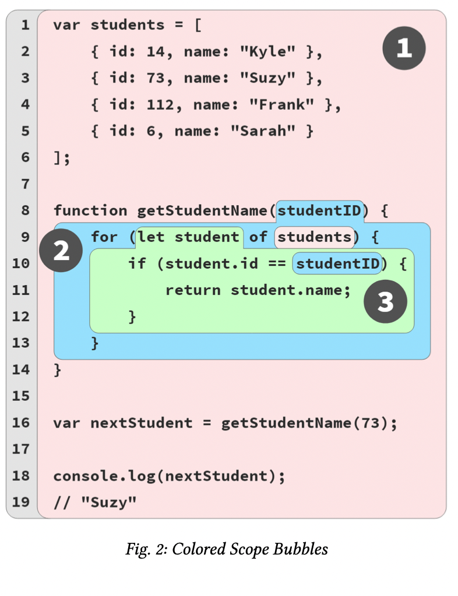
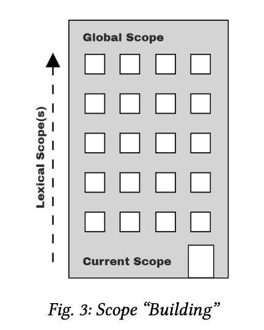

### Table of contents: <!-- omit in toc -->

- [Chapter 2: Illustrating Lexical Scope](#chapter-2-illustrating-lexical-scope)
    - [Marbles, and Buckets, and Bubbles... Oh My!](#marbles-and-buckets-and-bubbles-oh-my)
    - [A Conversation Among Friends](#a-conversation-among-friends)
    - [Nested Scope](#nested-scope)
      - [Lookup Failures](#lookup-failures)
      - [Undefined Mess](#undefined-mess)
      - [Global... What!?](#global-what)
      - [Building On Metaphors](#building-on-metaphors)

# Chapter 2: Illustrating Lexical Scope

This chapter will illustrate scope with several metaphors. The goal here is to think about how your program is handled by the JS engine in ways that more closely align with how the JS engine actually works.

### Marbles, and Buckets, and Bubbles... Oh My!

One metaphor I’ve found effective in understanding scope is sorting colored marbles into buckets of their matching color.


Imagine you come across a pile of marbles, and notice that all the marbles are colored red, blue, or green. Let’s sort all the marbles, dropping the red ones into a red bucket, green into a green bucket, and blue into a blue bucket. After sorting, when you later need a green marble, you already know the green bucket is where to go to get it.

n this metaphor, the marbles are the variables in our pro- gram. The buckets are scopes (functions and blocks), which we just conceptually assign individual colors for our discus- sion purposes. The color of each marble is thus determined by which color scope we find the marble originally created in.

Let’s annotate the running program example from Chapter 1 with scope color labels:

```Js
// outer/global scope: RED

var students = [
    { id: 14, name: "Kyle" }, 
    { id: 73, name: "Suzy" }, 
    { id: 112, name: "Frank" }, 
    { id: 6, name: "Sarah" }
];

function getStudentName(studentID) {
    // function scope: BLUE
    for (let student of students) { 
        // loop scope: GREEN
        if (student.id == studentID) { 
            return student.name;
        } 
    }
}

var nextStudent = getStudentName(73); 
console.log(nextStudent); // Suzy
```

We’ve designated three scope colors with code comments: RED (outermost global scope), BLUE (scope of function get- StudentName(..)), and GREEN (scope of/inside the for loop).

Figure 2 helps visualize the boundaries of the scopes by drawing colored bubbles (aka, buckets) around each:




1. Bubble 1 (RED) encompasses the global scope, which holds three identifiers/variables: students (line 1), get- StudentName (line 8), and nextStudent (line 16).
2. Bubble 2 (BLUE) encompasses the scope of the function getStudentName(..) (line 8), which holds just one identifier/variable: the parameter studentID (line 8).
3. Bubble 3 (GREEN) encompasses the scope of the for- loop (line 9), which holds just one identifier/variable: student (line 9).

Scope bubbles are determined during compilation based on where the functions/blocks of scope are written, the nesting inside each other, and so on.

Each marble (variable/identifier) is colored based on which bubble (bucket) it’s declared in, not the color of the scope it may be accessed from (e.g., students on line 9 and studen- tID on line 10).

Scopes **can nest inside each other** as shown, to any depth of nesting as your program needs.

An expression in the RED(1) bucket only has access to RED(1) marbles, not BLUE(2) or GREEN(3).

An expression in the BLUE(2) bucket can reference either BLUE(2) or RED(1) mar- bles, not GREEN(3).

And an expression in the GREEN(3) bucket has access to RED(1), BLUE(2), and GREEN(3) marbles.

The determination of colored buckets, and the marbles they contain, happens during compilation. This infor- mation is used for variable (marble color) “lookups” during code execution.

### A Conversation Among Friends

Another useful metaphor for the process of analyzing vari- ables and the scopes they come from is to imagine various conversations that occur inside the engine as code is processed and then executed.

Let’s now meet the members of the JS engine that will have conversations as they process our program:

* Engine: responsible for start-to-finish compilation and execution of our JavaScript program.
* Compiler: one of Engine’s friends; handles all the dirty work of parsing and code-generation (see previous sec- tion).
* Scope Manager: another friend of Engine; collects and maintains a lookup list of all the declared variables/i- dentifiers, and enforces a set of rules as to how these are accessible to currently executing code.

Let's retake the previus code: 

```Js
var students = [
    { id: 14, name: "Kyle" }, 
    { id: 73, name: "Suzy" }, 
    { id: 112, name: "Frank" }, 
    { id: 6, name: "Sarah" }
];

function getStudentName(studentID) { 
    for (let student of students) {
        if (student.id == studentID) { 
            return student.name;
        } 
    }
}

var nextStudent = getStudentName(73); 

console.log(nextStudent);
// Suzy
```

The array and its contents are just basic JS value literals (and thus unaffected by any scoping concerns), so our focus here will be on the var students = [ .. ] declaration and initialization- assignment parts.

We typically think of that as a single statement, but that’s not how our friend Engine sees it.

In fact, JS treats these as two distinct operations, one which Compiler will handle during compilation, and the other which Engine will handle during execution.

The first thing Compiler will do with this program is perform lexing to break it down into tokens, which it will then parse into a tree (AST).

Here’s the steps Compiler will follow to handle that state- ment:

1. Encountering var students, Compiler will ask Scope Manager to see if a variable named students already exists for that particular scope bucket. If so, Compiler would ignore this declaration and move on. Otherwise, Compiler will produce code that (at execution time) asks Scope Manager to create a new variable called students in that scope bucket.
2. Compiler then produces code for Engine to later execute, to handle the students = [] assignment. The code Engine runs will first ask Scope Manager if there is a variable called students accessible in the current scope bucket. If not, Engine keeps looking elsewhere (see “Nested Scope” below). Once Engine finds a variable, it assigns the reference of the [ .. ] array to it.

In conversational form, the first phase of compilation for the program might play out between Compiler and Scope Manager like this:

*Compiler: Hey, Scope Manager (of the global scope), I found a formal declaration for an identifier called students, ever heard of it?*

*(Global) Scope Manager: Nope, never heard of it, so I just created it for you.*

*Compiler: Hey, Scope Manager, I found a formal declaration for an identifier called getStudent- Name, ever heard of it?*

*(Global) Scope Manager: Nope, but I just created it for you.*

*Compiler: Hey, Scope Manager,getStudentName points to a function, so we need a new scope bucket.*

*(Function) Scope Manager: Got it, here’s the scope bucket.*

*Compiler: Hey, Scope Manager (of the function), I found a formal parameter declaration for studen- tID, ever heard of it?*

*(Function) Scope Manager: Nope, but now it’s created in this scope.*

*(Function) Scope Manager: Nope, but now it’s created in this scope.*

The conversation is a question-and-answer exchange, where Compiler asks the current Scope Manager if an encountered identifier declaration has already been encountered. If “no,” Scope Manager creates that variable in that scope.

If the answer is “yes,” then it’s effectively skipped over since there’s nothing more for that Scope Manager to do.

Later, when it comes to execution of the program, the con- versation will shift to Engine and Scope Manager, and might play out like this:

*Engine: Hey, Scope Manager (of the global scope), before we begin, can you look up the identifier getStudentName so I can assign this function to it?*

*(Global) Scope Manager: Yep, here’s the variable.*

*Engine: Hey, Scope Manager, I found a target reference for students, ever heard of it?*

*(Global) Scope Manager: Yes, it was formally declared for this scope, so here it is.*

*Engine: Thanks, I’m initializing students to undefined, so it’s ready to use.*

*Hey, Scope Manager (of the global scope), I found a target reference for nextStudent, ever heard of it?*

*(Global) Scope Manager: Yes, it was formally declared for this scope, so here it is.*

*Engine: Thanks, I’m initializing nextStudent to undefined, so it’s ready to use.*

*Hey, Scope Manager (of the global scope), I found a source reference for getStudentName, ever heard of it?*

*(Global) Scope Manager: Yes, it was formally declared for this scope. Here it is.*

*Engine: Great, the value in getStudentName is a function, so I’m going to execute it.*

*Engine: Hey, Scope Manager, now we need to instantiate the function’s scope.*

To review and summarize how a statement like var stu- dents = [ .. ] is processed, in two distinct steps:

1. Compiler sets up the declaration of the scope variable (since it wasn’t previously declared in the current scope). 
2. While Engine is executing, to process the assignment part of the statement, Engine asks Scope Manager to look up the variable, initializes it to undefined so it’s ready
to use, and then assigns the array value to it.

### Nested Scope

When it comes time to execute the getStudentName() func- tion, Engine asks for a Scope Manager instance for that function’s scope, and it will then proceed to look up the parameter (studentID) to assign the 73 argument value to, and so on.

The function scope for getStudentName(..) is nested inside the global scope. The block scope of the for-loop is similarly nested inside that function scope. Scopes can be lexically nested to any arbitrary depth as the program defines.

Each scope gets its own Scope Manager instance each time that scope is executed (one or more times).

Each scope auto- matically has all its identifiers registered at the start of the scope being executed (this is called “variable hoisting”; see Chapter 5).

In the for (let student of students) { statement, stu- dents is a source reference that must be looked up. But how will that lookup be handled, since the scope of the function will not find such an identifier?

*Engine: Hey, Scope Manager (for the function), I have a source reference for students, ever heard of it?*

*(Function) Scope Manager: Nope, never heard of it. Try the next outer scope.*

*Engine: Hey, Scope Manager (for the global scope), I have a source reference for students, ever heard of it?*

*(Global) Scope Manager: Yep, it was formally declared, here it is.*

One of the key aspects of lexical scope is that any time an identifier reference cannot be found in the current scope, the next outer scope in the nesting is consulted; that process is repeated until an answer is found or there are no more scopes to consult.

#### Lookup Failures

When Engine exhausts all lexically available scopes (moving outward) and still cannot resolve the lookup of an identifier, an error condition then exists.
However, depending on the mode of the program (strict-mode or not) and the role of the variable (i.e., target vs. source; see Chapter 1), this error condition will be handled differently.

#### Undefined Mess

The error message for an undeclared variable condition, in most JS environments, will look like, “Reference Error: XYZ is not defined.” The phrase “not defined” seems almost identical to the word “undefined,” as far as the English language goes.

But these two are very different in JS, and this error message unfortunately creates a persistent confusion.

“Not defined” really means “not declared”—or, rather, “unde- clared,” as in a variable that has no matching formal declara- tion in any lexically available scope. By contrast, “undefined” really means a variable was found (declared), but the variable otherwise has no other value in it at the moment, so it defaults to the *undefined value*.

To perpetuate the confusion even further, JS’s typeof opera- tor returns the string "undefined" for variable references in either state:

```Js
var studentName;
typeof studentName; // "undefined"

typeof doesntExist; // "undefined"
```

These two variable references are in very different conditions,
but JS sure does muddy the waters. The terminology mess is confusing and terribly unfortunate. Unfortunately, JS devel- opers just have to pay close attention to not mix up which kind of “undefined” they’re dealing with!

#### Global... What!?

If the variable is a target and strict-mode is not in effect, a confusing and surprising legacy behavior kicks in. The troublesome outcome is that the global scope’s Scope Manager will just create an **accidental global variable** to fulfill that target assignment!

```Js
function getStudentName() {
    // assignment to an undeclared variable :( 
    nextStudent = "Suzy";
}

getStudentName();

console.log(nextStudent);
// "Suzy" -- oops, an accidental-global variable!
```

Here’s how that conversation will proceed:

*Engine: Hey, Scope Manager (for the function), I have a target reference for nextStudent, ever heard of it?*

*(Function) Scope Manager: Nope, never heard of it. Try the next outer scope.*

*Engine: Hey, Scope Manager (for the global scope), I have a target reference for nextStudent, ever heard of it?*

*(Global) Scope Manager: Nope, but since we’re in non-strict-mode, I helped you out and just created a global variable for you, here it is!*

In strict-mode, the Global Scope Manager would instead have responded:

*(Global) Scope Manager: Nope, never heard of it. Sorry, I’ve got to throw a ReferenceError.*

Never rely on accidental global variables. Always use strict- mode, and always formally declare your variables. You’ll then get a helpful ReferenceError if you ever mistakenly try to assign to a not-declared variable.

#### Building On Metaphors

To visualize nested scope resolution, I prefer yet another metaphor, an office building, as in Figure 3:



The building represents our program’s nested scope collec- tion. 

The first floor of the building represents the currently executing scope.

The top level of the building is the global scope.

You resolve a target or source variable reference by first looking on the current floor, and if you don’t find it, taking the elevator to the next floor (i.e., an outer scope), looking there, then the next, and so on. Once you get to the top floor (the global scope), you either find what you’re looking for, or you don’t. But you have to stop regardless.
