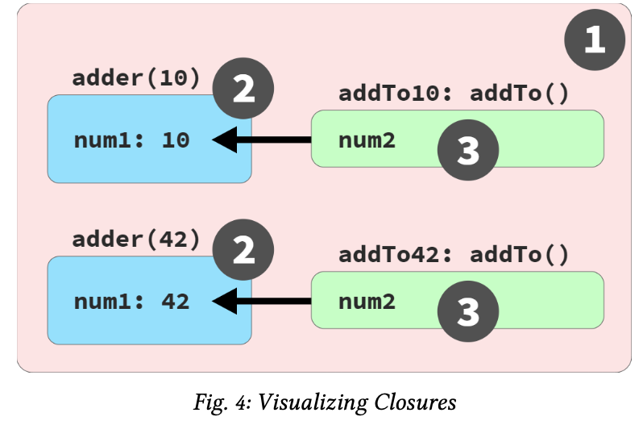
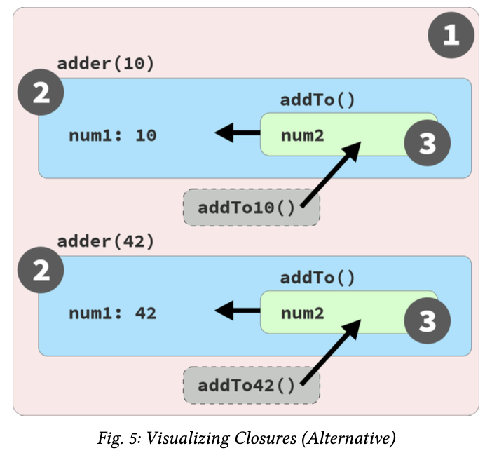

### Table of contents: <!-- omit in toc -->

- [Chapter 7: Using Closures](#chapter-7-using-closures)
    - [See the Closure](#see-the-closure)
      - [Pointed Closure](#pointed-closure)
      - [Adding Up Closures](#adding-up-closures)
      - [Live Link, Not a Snapshot](#live-link-not-a-snapshot)
      - [Common Closures: Ajax and Events](#common-closures-ajax-and-events)
      - [What If I Can’t See It?](#what-if-i-cant-see-it)
      - [Observable Definition](#observable-definition)
    - [The Closure Lifecycle and Garbage Collection (GC) !important](#the-closure-lifecycle-and-garbage-collection-gc-important)
      - [Per Variable or Per Scope?](#per-variable-or-per-scope)
    - [An Alternative Perspective](#an-alternative-perspective)
    - [Why Closure? !Important](#why-closure-important)
    - [Closer to Closure](#closer-to-closure)

# Chapter 7: Using Closures

Closure builds on this approach: for variables we need to use over time, instead of placing them in larger outer scopes, we can encapsulate (more narrowly scope) them but still preserve access from inside functions, for broader use

Functions re- member these referenced scoped variables via closure.

If you’ve ever written a callback that accesses variables outside its own scope... guess what!? That’s closure.

Closure is one of the most important language characteristics ever invented in programming—it underlies major program- ming paradigms, including Functional Programming (FP), modules, and even a bit of class-oriented design.

### See the Closure

Closure is originally a mathematical concept, from lambda calculus.

Closure is a behavior of functions and only functions. 

For closure to be observed, a function must be invoked, and specifically it must be invoked in a different branch of the scope chain from where it was originally defined.

Let’s look at some code, annotated with its relevant scope bubble colors (see Chapter 2):

```Js
// outer/global scope: RED(1)
function lookupStudent(studentID) { 
    // function scope: BLUE(2)
    var students = [
        { id: 14, name: "Kyle" }, 
        { id: 73, name: "Suzy" }, 
        { id: 112, name: "Frank" }, 
        { id: 6, name: "Sarah" }
    ];
    return function greetStudent(greeting){
        // function scope: GREEN(3)
        var student = students.find(
            student => student.id == studentID
        );
        return `${ greeting }, ${ student.name }!`; 
    };
}

var chosenStudents = [ 
    lookupStudent(6), 
    lookupStudent(112)
];

// accessing the function's name:
chosenStudents[0].name;
// greetStudent
chosenStudents[0]("Hello");
// Hello, Sarah!
chosenStudents[1]("Howdy");
// Howdy, Frank!
```

Closure allows greetStudent(..) to continue to access those outer variables even after the outer scope is finished (when each call to lookupStudent(..) completes).

Instead of the instances of students and studentID being GC’d (Garbage collector), they stay around in memory. 

At a later time when either instance of the greetStudent(..) function is invoked, those variables are still there, holding their current values.

The fact that the execution of chosenStudents[0]("Hello") works and returns us the message “Hello, Sarah!”, means it was still able to access the students and studentID variables.

This is a direct observation of closure!

#### Pointed Closure

Because of how terse the syntax for => arrow functions is, it’s easy to forget that they still create a scope (as asserted in “Arrow Functions” in Chapter 3).

The student => stu- dent.id == studentID arrow function is creating another scope bubble inside the greetStudent(..) function scope.

if we were creating a colored diagram for this code, there’s a fourth scope at this innermost nesting level, so we’d need a fourth color; perhaps we’d pick ORANGE(4) for that scope:

```Js
var student = students.find(
        student =>
            // function scope: ORANGE(4)
            student.id == studentID
);
```

The BLUE(2) studentID reference is actually inside the OR- ANGE(4) scope rather than the GREEN(3) scope of greet- Student(..); also, the student parameter of the arrow function is ORANGE(4), **shadowing** the GREEN(3) student.

The consequence here is that this arrow function passed as a callback to the array’s find(..) method has to hold the closure over studentID, rather than greetStudent(..) holding that closure.

It’s just important not to skip over the fact that even tiny arrow functions can get in on the closure party.

#### Adding Up Closures

Let’s examine one of the canonical examples often cited for closure:

```Js
function adder(num1) {
    return function addTo(num2){
        return num1 + num2; 
    };
}
var add10To = adder(10);
var add42To = adder(42); 

add10To(15); // 25
add42To(9);     // 51
```

Each instance of the inner addTo(..) function is closing over its own num1 variable (with values 10 and 42, respectively), so those num1’s don’t go away just because adder(..) fin- ishes. When we later invoke one of those inner addTo(..) instances, such as the add10To(15) call, its closed-over num1 variable still exists and still holds the original 10 value. The operation is thus able to perform 10 + 15 and return the answer 25.

closure is associated with an instance of a function, rather than its single lexical definition. In the preceding snippet, there’s just one inner addTo(..) function defined inside adder(..), so it might seem like that would imply a single closure.

So each inner function instance (labeled add10To(..) and add42To(..) in our program) has its own closure over its own instance of the scope environment from that execution of adder(..).

#### Live Link, Not a Snapshot

We read the value from a variable that was held in a closure.

That makes it feel like closure might be a snapshot of a value at some given moment. Indeed, that’s a common misconception.

Closure is actually a live link, preserving access to the full variable itself.

We’re not limited to merely reading a value; the closed-over variable can be updated (re-assigned) as well!

we can keep using that variable (read and write) as long as that function refer- ence exists in the program, and from anywhere we want to invoke that function.

This is why closure is such a powerful technique used widely across so many areas of programming!


 
As shown in Figure 4, each call to adder(..) creates a new BLUE(2) scope containing a num1 variable, as well as a new instance of addTo(..) function as a GREEN(3) scope.

Notice that the function instances (addTo10(..) and addTo42(..)) are present in and invoked from the RED(1) scope.

Now let’s examine an example where the closed-over variable is updated:

```Js
function makeCounter() { 
    var count = 0;
    
    return getCurrent(){ 
        count = count + 1; return count;
    }; 
}
var hits = makeCounter(); 

// later

hits(); // 1

// later
hits();     // 2
hits();     // 3
```

#### Common Closures: Ajax and Events

Closure is most commonly encountered with callbacks:

```Js
function lookupStudentRecord(studentID) { 
    ajax(
        `https://some.api/student/${ studentID }`, 
        function onRecord(record) {
            console.log(
                `${ record.name } (${ studentID })`
            ); 
        }
    ); 
}

lookupStudentRecord(114);
// Frank (114)
```

The onRecord(..) callback is going to be invoked at some point in the future, after the response from the Ajax call comes back.

This invocation will happen from the internals of the ajax(..) utility, wherever that comes from. Furthermore, when that happens, the lookupStudentRecord(..) call will long since have completed.

Why then is studentID still around and accessible to the callback? Closure.

Event handlers are another common usage of closure:

```Js
function listenForClicks(btn,label) { 
    btn.addEventListener("click",function onClick(){
        console.log(
            `The ${ label } button was clicked!`
        ); 
    });
}

var submitBtn = document.getElementById("submit-btn"); 

listenForClicks(submitBtn,"Checkout");
```

The label parameter is closed over by the onClick(..) event handler callback. When the button is clicked, label still exists to be used. This is closure.

#### What If I Can’t See It?

If a closure exists (in a technical, implementation, or academic sense) but it cannot be observed in our programs, does it matter? No.

For example, invoking a function that makes use of lexical scope lookup:

```Js
function say(myName) {
    var greeting = "Hello"; 
    output();

    function output() { 
        console.log(
            `${ greeting }, ${ myName }!` 
        );
    } 
}

say("Kyle");
// Hello, Kyle!
```

The inner function output() accesses the variables greet- ing and myName from its enclosing scope.

But the invocation of output() happens in that same scope, where of course greeting and myName are still available; that’s just lexical scope, not closure.

Any lexically scoped language whose functions didn’t sup- port closure would still behave this same way.

In fact, global scope variables essentially cannot be (observ- ably) closed over, because they’re always accessible from everywhere.

#### Observable Definition

We’re now ready to define closure:

Closure is observed when a function uses vari- able(s) from outer scope(s) even while running in a scope where those variable(s) wouldn’t be accessible.

The key parts of this definition are:

* Must be a function involved
* Must reference at least one variable from an outer scope 
* Must be invoked in a different branch of the scope chain
from the variable(s)

### The Closure Lifecycle and Garbage Collection (GC) !important

Since closure is inherently tied to a function instance, its closure over a variable lasts as long as there is still a reference to that function.

If ten functions all close over the same variable, and over time nine of these function references are discarded, the lone remaining function reference still preserves that variable.

Once that final function reference is discarded, the last closure over that variable is gone, and the variable itself is GC’d.

This has an important impact on building efficient and per- formant programs. 

Closure can unexpectedly prevent the GC of a variable that you’re otherwise done with, which leads to run-away memory usage over time.

That’s why it’s important to discard function references (and thus their closures) when they’re not needed anymore.

Consider:

```Js
function manageBtnClickEvents(btn) { 
    var clickHandlers = [];
    return function listener(cb){ 
        if (cb) {
            let clickHandler = 
                function onClick(evt){
                    console.log("clicked!");
                    cb(evt); 
                };
            clickHandlers.push(clickHandler);
            btn.addEventListener(
                "click",
                clickHandler
            );
        }
        else {
            // passing no callback unsubscribes 
            // all click handlers
            for (let handler of clickHandlers) {
                btn.removeEventListener(
                    "click",
                    handler 
                );
            }

            clickHandlers = [];
        }
    }; 
}

// var mySubmitBtn = ..
var onSubmit = manageBtnClickEvents(mySubmitBtn);

onSubmit(function checkout(evt){ 
    // handle checkout
});

onSubmit(function trackAction(evt){ 
    // log action to analytics
});

// later, unsubscribe all handlers:
onSubmit();
```

In this program, the inner onClick(..) function holds a closure over the passed in cb (the provided event callback).

That means the checkout() and trackAction() function expression references are held via closure (and cannot be GC’d) for as long as these event handlers are subscribed.

When we call onSubmit() with no input on the last line, all event handlers are unsubscribed, and the clickHandlers array is emptied.

Once all click handler function references are discarded, the closures of cb references to checkout() and trackAction() are discarded.

When considering the overall health and efficiency of the program, unsubscribing an event handler when it’s no longer needed can be even more important than the initial subscription!

#### Per Variable or Per Scope?

Another question we need to tackle: should we think of closure as applied only to the referenced outer variable(s), or does closure preserve the entire scope chain with all its variables?

Conceptually, closure is per variable rather than per scope.

Ajax callbacks, event handlers, and all other forms of function closures are typically assumed to close over only what they explicitly reference.

Another program to consider:

```js
// Me: i think studentRecords could be an API response
function manageStudentGrades(studentRecords) { 
    var grades = studentRecords.map(getGrade);
    // Creates a new array to avoid modifying the original from parameter (a reference)
    
    return addGrade;
    
    // ************************
    function getGrade(record){ 
        return record.grade;
    }
    function sortAndTrimGradesList() { 
        // sort by grades, descending 
        grades.sort(function desc(g1,g2){
            return g2 - g1; 
        });
        
        // only keep the top 10 grades
        grades = grades.slice(0,10);
    }
    
    function addGrade(newGrade) { 
        grades.push(newGrade); 
        sortAndTrimGradesList(); 
        return grades;
    } 
}

var addNextGrade = manageStudentGrades([ 
    { id: 14, name: "Kyle", grade: 86 }, 
    { id: 73, name: "Suzy", grade: 87 }, 
    { id: 112, name: "Frank", grade: 75 }, 
    // ..many more records..
    { id: 6, name: "Sarah", grade: 91 }
]);

// later

addNextGrade(81);
addNextGrade(68);
// [ .., .., ... ]
```

Many modern JS engines do apply an optimization that re- moves any variables from a closure scope that aren’t explicitly referenced.

However, as we see with eval(..), there are situations where such an optimization cannot be applied, and the closure scope continues to contain all its original variables.

In other words, closure must be per scope, implementation wise, and then an optional optimization trims down the scope to only what was closed over (a similar outcome as per variable closure).

In cases where a variable holds a large value (like an object or array) and that variable is present in a closure scope, if you don’t need that value anymore and don’t want that memory held, it’s safer (memory usage) to manually discard the value rather than relying on closure optimization/GC.

Let’s apply a fix to the earlier manageStudentGrades(..) example to ensure the potentially large array held in studen- tRecords is not caught up in a closure scope unnecessarily:

```Js
function manageStudentGrades(studentRecords) { 
    var grades = studentRecords.map(getGrade);
    // unset `studentRecords` to prevent unwanted 
    // memory retention in the closure 
    studentRecords = null;
    // Me: like what we did in that company bus project hehe.
    // So i think here we're cleaning the hypothetical API response variable.
    
    return addGrade;
    // ..
}
```

We’re not removing studentRecords from the closure scope; that we cannot control.

We’re ensuring that even if stu- dentRecords remains in the closure scope, that variable is no longer referencing the potentially large array of data; the array can be GC’d.

Again, in many cases JS might automatically optimize the program to the same effect.

But it’s still a good habit to be careful and explicitly make sure we don’t keep any significant amount of device memory tied up any longer than necessary.

The takeaway: it’s important to know where closures appear in our programs, and what variables are included. We should manage these closures carefully so we’re only holding onto what’s minimally needed and not wasting memory.

### An Alternative Perspective

Reviewing our working definition for closure, the assertion is that functions are “first-class values” that can be passed around the program, just like any other value.

Closure is the link-association that connects that function to the scope/vari- ables outside of itself, no matter where that function goes.

Let’s recall a code example from earlier in this chapter, again with relevant scope bubble colors annotated:

```Js
// outer/global scope: RED(1)

function adder(num1) {
    // function scope: BLUE(2)

    return function addTo(num2){ 
        // function scope: GREEN(3)
        return num1 + num2; 
    };
}

var add10To = adder(10); 
var add42To = adder(42);

add10To(15);    // 25
add42To(9);     // 51
```

Our current perspective suggests that wherever a function is passed and invoked, closure preserves a hidden link back to the original scope to facilitate the access to the closed-over variables. 

Figure 4, repeated here for convenience, illustrates this notion:


But there’s another way of thinking about closure, and more precisely the nature of functions being passed around, that may help deepen the mental models.

Instead of thinking about the inner function instance of addTo(..) moving to the outer RED(1) scope via the return and assignment, we can envision that function instances actually just stay in place in their own scope environment, of course with their scope-chain intact.

What gets sent to the RED(1) scope is just a reference to the in-place function instance, rather than the function instance itself. Figure 5 depicts the inner function instances remaining in place, pointed to by the RED(1) addTo10 and addTo42 references, respectively:



As shown in Figure 5, each call to adder(..) still creates a new BLUE(2) scope containing a num1 variable, as well as an instance of the GREEN(3) addTo(..) scope. But what’s different from Figure 4 is, now these GREEN(3) instances remain in place, naturally nested inside of their BLUE(2) scope instances.

The addTo10 and addTo42 references are moved to the RED(1) outer scope, not the function instances themselves.

When addTo10(15) is called, the addTo(..) function in- stance (still in place in its original BLUE(2) scope environ- ment) is invoked. Since the function instance itself never moved, of course it still has natural access to its scope chain.

Same with the addTo42(9) call—nothing special here beyond lexical scope.

So what then is closure, if not the magic that lets a function maintain a link to its original scope chain even as that func- tion moves around in other scopes?

In this alternative model, functions stay in place and keep accessing their original scope chain just like they always could.

Closure instead describes the magic of **keeping alive a func- tion instance**, along with its whole scope environment and chain, for as long as there’s at least one reference to that function instance floating around in any other part of the program.

That definition of closure is less observational and a bit less familiar-sounding compared to the traditional academic perspective.

### Why Closure? !Important

Now that we have a well-rounded sense of what closure is and how it works, let’s explore some ways it can improve the code structure and organization of an example program.

Imagine you have a button on a page that when clicked, should retrieve and send some data via an Ajax request.

Without using closure:

```Js
var APIendpoints = { 
    studentIDs:
        "https://some.api/register-students",
    // ..
};

var data = {
    studentIDs: [ 14, 73, 112, 6 ],
    // ..
};

function makeRequest(evt) {
    var btn = evt.target;

    var recordKind = btn.dataset.kind; 
    ajax(
        APIendpoints[recordKind],
        data[recordKind]
    );
}

// <button data-kind="studentIDs">
//    Register Students
// </button>
btn.addEventListener("click",makeRequest);
```

The makeRequest(..) utility only receives an evt object from a click event.

From there, it has to retrieve the data- kind attribute from the target button element, and use that value to lookup both a URL for the API endpoint as well as what data should be included in the Ajax request.

Why couldn’t an event handler remember this value?

Let’s try using closure to improve the code:

```Js
var APIendpoints = { studentIDs:
        "https://some.api/register-students",
    // ..
};

var data = {
    studentIDs: [ 14, 73, 112, 6 ], 
    // ..
};
function setupButtonHandler(btn) {
    var recordKind = btn.dataset.kind;
    btn.addEventListener(
        "click",
        function makeRequest(evt){
            ajax(
                APIendpoints[recordKind],
                data[recordKind]
            );
        }
    ); 
}

// <button data-kind="studentIDs">
//    Register Students
// </button>

setupButtonHandler(btn);
```

With the setupButtonHandler(..) approach, the data- kind attribute is retrieved once and assigned to the record- Kind variable at initial setup. 

recordKind is then closed over by the inner makeRequest(..) click handler, and its value is used on each event firing to look up the URL and data that should be sent.

By placing recordKind inside setupButtonHandler(..), we limit the scope exposure of that variable to a more appro- priate subset of the program; storing it globally would have been worse for code organization and readability.

the inner makeRequest() function instance remember this variable and access whenever it’s needed.

Building on this pattern, we could have looked up both the URL and data once, at setup:

```Js
function setupButtonHandler(btn) {
    var recordKind = btn.dataset.kind;
    var requestURL = APIendpoints[recordKind]; 
    var requestData = data[recordKind];
    btn.addEventListener(
        "click",
        function makeRequest(evt){ 
            ajax(requestURL,requestData);
            //Me: i think this is like we used to wrap Axios request
        } 
    );
}
```

Now makeRequest(..) is closed over requestURL and re- questData, which is a little bit cleaner to understand, and also slightly more performant.

By creating a function instance that encapsulates some in- formation inside (via closure), the function-with-stored-in- formation can later be used directly without needing to re- provide that input. This makes that part of the code cleaner, and also offers the opportunity to label partially applied functions with better semantic names.

Adapting partial application, we can further improve the preceding code:

```Js
//Me: This looks cleaner i guess
function defineHandler(requestURL,requestData) { 
    return function makeRequest(evt){
        ajax(requestURL,requestData);
    };
}
function setupButtonHandler(btn) { 
    var recordKind = btn.dataset.kind; 
    
    var handler = defineHandler(
        APIendpoints[recordKind],
        data[recordKind]
    );
    btn.addEventListener("click",handler);
}
```

The requestURL and requestData inputs are provided ahead of time, resulting in the makeRequest(..) partially applied function, which we locally label handler.

When the event eventually fires, the final input (evt, even though it’s ignored) is passed to handler(), completing its inputs and triggering the underlying Ajax request.

Behavior-wise, this program is pretty similar to the pre- vious one, with the same type of closure.

But by isolat- ing the creation of makeRequest(..) in a separate util- ity (defineHandler(..)), we make that definition more reusable across the program.

We also explicitly limit the closure scope to only the two variables needed.

### Closer to Closure

We explored two models for mentally tackling closure:

* Observational: closure is a function instance remember- ing its outer variables even as that function is passed to and invoked in other scopes.
* Implementational: closure is a function instance and its scope environment preserved in-place while any refer- ences to it are passed around and invoked from other scopes.

Summarizing the benefits to our programs:

* Closure can improve efficiency by allowing a function instance to remember previously determined informa- tion instead of having to compute it each time.
* Closure can improve code readability, bounding scope- exposure by encapsulating variable(s) inside function instances, while still making sure the information in those variables is accessible for future use. 
The resul- tant narrower, more specialized function instances are cleaner to interact with, since the preserved information doesn’t need to be passed in every invocation.